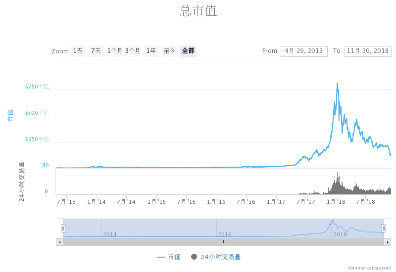
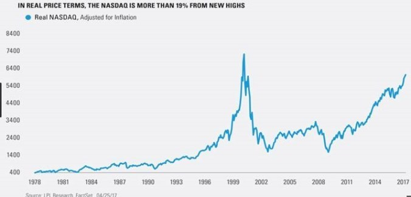
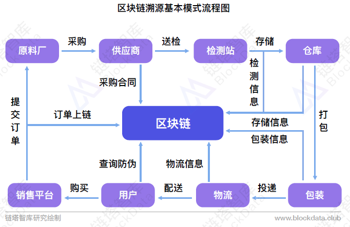
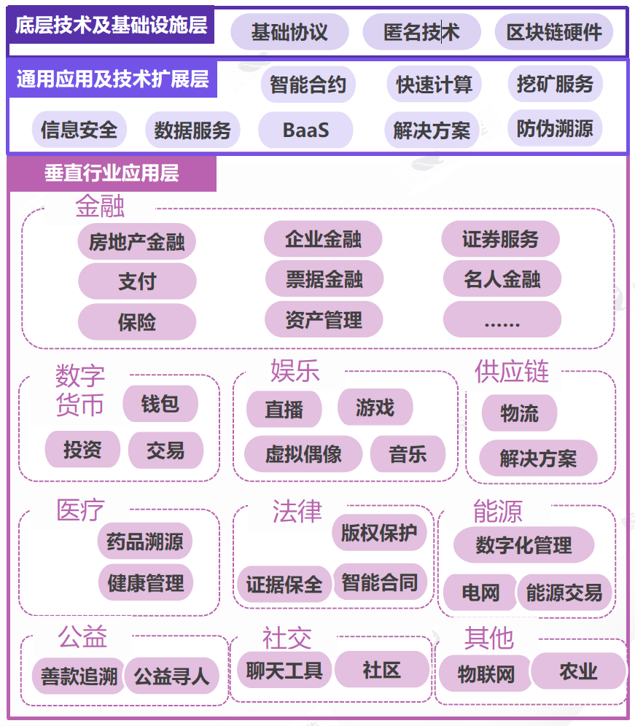

# 致协会成员的一封信

    所有的伟大，都源于一个勇敢的开始。

亲爱的同学，当你看到这篇文章的时候，意味着你已经成为浙大区块链协会的一员，即将或已经开始区块链的探索之旅。

## 值得被铭记的历史
2008年，一位网名为“中本聪”的热心网友希望构建一个无政府垄断的世界货币，发布了一篇名为《比特币：一种点对点式的电子现金系统》的论文，描述了一种称为“比特币”的加密数字货币及算法。2009年，首个比特币软件问世，比特币主网正式启动，将世界带进了区块链的大门。

2013年，一位名叫Vitalik Buterin的19岁青年，发表了《以太坊白皮书》，希望构建“下一代加密货币与去中心化应用平台”。2015年7月30日，以太坊主网启动，世界不仅拥有了**加密货币**，还迎来了**智能合约**。人们开始使用以太坊构建**去中心化应用(Decentralized Application)**，给世界带来了无数的灵感与创新。

2015年末，联盟区块链开始进入商业科技的视野。IBM首先嗅到了联盟区块链的机会，研发并开源了[超级账本Hyper Ledger](https://github.com/hyperledger/hyperledger)项目，将区块链技术带进了企业级市场。2016年起，国内也诞生了许多联盟链的初创企业，如趣链科技、云象科技、秘猿科技、阿尔山金融科技等。蚂蚁金服、百度、腾讯等传统互联网巨头，也开始布局联盟区块链。经过2年的探索，在供应链金融、数字票据、企业应收账款、跨境支付结算、征信等众多2B领域，已经涌现出很多可行的“区块链+”解决方案。

2018年6月份，新一代公共区块链基础平台[EOSIO](https://eos.io/)正式启动。EOSIO由曾创办两个成功的区块链项目([bitShare](https://bitshares.org/)与[Steemit](https://steemit.com/))、著名技术专家的Daniel Larimer(BM)联合创办，其融资总额超过40亿美金，自2017年成立以来便备受关注，其独特的DPOS共识机制更是毁誉参半。如今，EOSIO将饱受诟病的公有链性能指标TPS(每秒处理交易数)，从比特币的7tps与以太坊的15tps，大幅提升至最高4000tps(截止撰写本文时)。**公有链平台开始向大规模商业应用敞开大门。**

区块链的这十年，正如互联网的前十年，野蛮成长，充满机会，但也被贪婪、泡沫所笼罩。2013年12月份，加密货币总市值达到历史最高的150亿美金，而在随后的两年，猛然跌至最低不足40亿美金；2017年12月份，加密货币总市值再次突破历史新高，达到8200亿美金，而在随后的2018年，又惨烈地跌至1300亿美金(撰写本文时)。

熟悉2000年互联网泡沫那段历史的同学，看到上面这幅曲线，一定感觉似曾相识。没错，我们来看一下近40年来Nasdaq的指数走势。

我们今天看到的光鲜亮丽的互联网巨头，也未曾幸免于互联网泡沫——全球最大的电商之一亚马逊股价从1999年底最高的100美元，跌至2001年的10美元；全球最大的OTA Booking集团，股价从最高的900美元一度跌至1美元；网易公司的股价从2000年上市时的15美元跌至0.15美元，一度濒临破产……这样的例子无不在告诉我们：**早期互联网投资领域出现的泡沫和低估，反映了新兴技术在早期发展中，每每被人们或捧杀、或棒杀；历史总是在重复，加密资产与区块链领域，也在面临同样的遭遇。**

## 区块链到底是什么

区块链本质上是一个多方参与的可信任的分布式加密账本。顾名思义，它有三个不可或缺的组成部分：

- 多方参与
- 可信任
- 分布式加密账本

### 多方参与
区块链上的用户类型可归纳为以下三个身份：

- 出块者：负责打包交易并产出区块（记账）。
- 验证者：验证出块者产生的区块是否合法，并记账。
- 普通用户：使用区块链提供的各种功能服务。

出块者与验证者一同完成打包交易并记账，延长区块链，使系统正常运转。普通用户使用区块链提供的基础服务，向出块者和验证者支付手续费作为激励，同时，出块行为本身也会有一定奖励，该奖励可视为**区块链系统中价值媒介(代币)的合理通胀**。通过多方参与，实现了区块链生态系统内的价值流转闭环。

上述三种参与方，在公有链和联盟链中，有着截然不同的机制——

在公有链中，出块者一般也为验证者（被称为矿工），有以下两点特征：

1. 出块需要花费成本，并且成本需要随着矿工数量的增加而增加。这保证了系统的稳定性。
2. 出块有奖励，且奖励大于成本，这保证了矿工有出块的动力。

验证者对于全网共识来说有时也非必要的。如在POW共识算法中，不参与挖矿的验证者（也被称为全节点）对共识并不做贡献，但因多了一份备份而增强了全网的数据安全；而在POS、DPOS和BFT族共识算法中，**验证者须要对新区块进行投票、签名与转发，因此也对区块共识做出贡献。**

而在联盟链中，出块者往往是利益相关的业务方。这些业务方作为出块节点时，因参与方之间有着商业合同与业务契约，并不需要依靠如公有链中的经济循环来维持联盟链的正常运转。所以，在联盟链系统中，出块节点也不需要所谓的出块奖励，其共识算法常常是BFT族的一致性算法，不需要通过消耗能源来表征出块成本。

### 可信任
可信任，顾名思义，即任何参与方都能够信任区块链上数据的真实性。这要求区块链上的数据满足以下两个条件：

1. 上链后不可篡改。
2. 可供任何参与方审查。
3. 可追溯。

现阶段的主流媒体，包括行业KOL，常常将**去中心化**作为区块链可信任的原因之一，这其实是非常片面的。可信任的本质是**共识**。**去中心化**最容易让复杂的人类群体产生共识，但这并不代表**中心化**不能够达成共识。我们可以回想，**支付宝**、**微信支付**等第三方支付，本质也是中心化的，经过长久的产品运营和企业信用积累，越来越多的人信任这些第三方机构，并使用它们的服务进行日常交易。

那么区块链与中心化数据库的最大区别在哪里？答案是：**区块链大大降低了建立信用的成本**。

**信任**是商业社会的基石，从石器时代到互联网时代，人类创造了灿烂的商业文明。然而，人类的商业体系一直是基于中心化的信任，原因是：在过去，我们无法实现在无监督、无中介的商业环境中进行价值流转，同时由于监管、审查的需要，中心化的体系仿佛更适合现代商业的发展。但是历史的发展已经告诉我们，中心化的商业结构带来了两个问题：

1. 单点的故障容易导致整个系统的故障。
2. 权力的集中容易导致权力滥用，产生腐败。

区块链的出现并非革“中心化”的命，而是**利用“去中心化”的架构改造部分业务，增强业务数据的公信力，降低信任成本，提供效率**。例如，在供应链溯源的场景中，核心企业对供应商的产品溯源，传统的方式往往是采用中心化的系统进行维护，并且不同供应商采用的可能是不同的中心化数据库。这带来了一个很严重的“信任”问题——在发生纠纷的时候，因为数据的背书方不同，标准不统一，很难找到具有公信力的数据进行举证。利用区块链的不可篡改和可追溯，统一为链上数据提供多方背书，恰好能够解决数据的公信力问题，同时易于追溯和审查，降低信任成本，使得追溯层级能够扩大，从而进一步提升产品溯源防伪的效率和准确性。

然而，在上述的溯源场景中，核心企业仍然对该区块链系统拥有较高的话语权，即**必须有权根据实际的商业合同，批准或驱逐相应的供应商节点**。同时，除了企业，政府部门和质检机构，通过作为区块链系统的一个节点，参与供应链的审查监督，提高整个生态圈的公信力。可见，区块链系统在2B场景应用中，将原本的“一个中心”，变为“多个中心”的架构，由多个中心组成一个可信任的“生态圈”，对数据真实性进行背书。

### 分布式加密账本
**分布式**意为有若干个服务器节点参与系统的运行；**加密账本**意为此账本上的数据均采用非对称加密算法进行交易签名、数据加密及所有权的确权。

区块链之所以被称为“区块”+“链”，正是由于其最初在比特币中体现出来的账本属性——每个“区块”即为一页账本，以“区块”组成的“链”如同由记账页组成的整个账本。我们可以通过查询账本条目，来获取每个账户的资产信息。得益于分布式、多冗余的特性，**某个恶意节点可以篡改自己的账本，但无法篡改其他人的账本**。只要保证**诚实节点**在一定比例以上，我们即可确保区块链数据的真实性。

## 下一代经济增长引擎
21世纪以来，互联网的出现，移动互联网、大数据、云计算、人工智能等新兴技术的发展，极大地解放了人类的生产力。然而，人类的生产关系与协作方式，近30年来并没有发生多大的变化。

马克思主义基本原理告诉我们：**生产力决定生产关系，生产关系要适应生产力的发展**。在区块链的10年发展中，人们发现区块链能极大地改变生产关系。

我想，这其中既有科技发展的偶然性，也有历史演变的必然性。

下面我将用大数据领域的数据交换例子，阐述区块链如何改变生产关系，从而进一步适应、解放生产力——

### 数据交换
进入大数据时代，人类掌握了更高效、更先进的数据处理技术，也研发了更安全、更便宜的数据存储方案。各家企业依托于自身的业务，沉淀下了海量的有价值数据，利用这些数据进一步提供了更优质的服务。同时，企业间也可以相互利用各自的数据优势，来优化自身的产品。

传统的数据交换分为两种：

1. 供需双方点对点的数据交换，通过签订商业合同，通过API接口打通数据。
2. 供需多方共建数据交换中心，该中心向数据所有方拉取、沉淀数据，并自建日志、订单系统，以记录商业信息。

然而上述两种方案均有很大的问题：

1. 点对点数据交换是**数据所有权而非使用权的交换**，需求方在买到数据后，很可能用于非合同商定的用途，或是直接二次出售。同时，API接口的暴露容易引来“数据爬虫”，危害数据安全。
2. 数据中心沉淀大量数据，容易成为黑客攻击的首选目标，极大威胁着各数据所有方的利益。
3. 数据中心运维成本高昂，且有难以解决的信任问题。比如人员配比、责任归属、纠纷解决等等，可能需要引入更多的第三方仲裁机构，大大增加了运营成本。

正是因为存在上述问题，数据交换领域迟迟没有探索出一个很好的解决方案。数据交换市场缺乏活力，各家数据的潜在价值没有被充分挖掘，各家企业陷入了数据孤岛的尴尬局面。

那么，区块链是如何解决这一问题的呢？

利用区块链的**智能合约**，企业间交换的不是**数据所有权**，而是**数据使用权**。

首先，不再需要数据交换中心，而是利用区块链搭建一个多方参与、可信任的订单撮合系统，匹配供需方的数据订单。

其次，**需求方将数据的处理流程以智能合约的形式表征，将数据处理模型的可执行文件存储在可信存储上(如IPFS)，各企业节点先从可信存储获取数据处理模型，再利用自己持有的数据作为参数放入计算，将最终的结果上链。这一过程，数据持有方无需暴露自己的数据**。由于区块链提供了数据不可篡改的特性，当涉及需要多方共同计算时，可以保证参与方A无法恶意篡改参与方B的计算结果，并可通过链上订单查验参与方是否真实提供数据参数。

最终，智能合约如同“旅行”一般，在各节点使用不同数据集作为参数计算后，需求方从链上获取加密过的计算结果。每一次计算环节都在链上留下凭据，方便未来出现纠纷时候的举证。如此，完成了一次无需暴露数据本身的可信任的数据交换。

在这一例子中，基于区块链的数据交换中，**供需双方的关系已经不再是“出售”与“购买”的关系，而变成了“授权”与“使用”的关系。“授权”与“使用”的生产关系，才是真正地适应了大数据时代数据交换和数据安全保障的迫切需求，真正地解放了数据的生产力。**

## 区块链行业现状
2017-2018年是区块链爆发性增长的一年，区块链从一个小众的技术，成为了一个备受关注的综合行业。到2018年末，区块链行业已呈现出三点重要的特征：

- 经历野蛮成长后，已成长为多元化的综合行业。
- 枭雄时代已过去，高素质人才与传统企业巨头正在进入行业。
- 人才需求更多元化。技术、产品、金融、投资、市场、商务等人才缺口不断扩大。

2018区块链产业结构

## 结语
马云经常在公开场合说一句话：“多数人因为看见而相信，少数人因为相信而看见”。

我希望，协会给你带来的，不仅是区块链的领域知识，还有迎接不确定性，直面未知事物的勇气与坚韧。

我希望，你在协会收获的，是超乎常人的学习能力，让你在未来能够适应瞬息万变的世界。

我希望，读到这里的你，愿意做那部分“少数人”。

2018年12月1日

ZJUBCA
